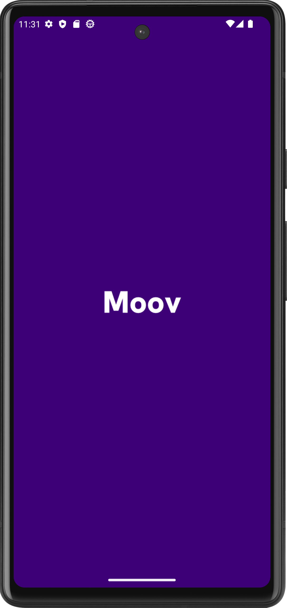
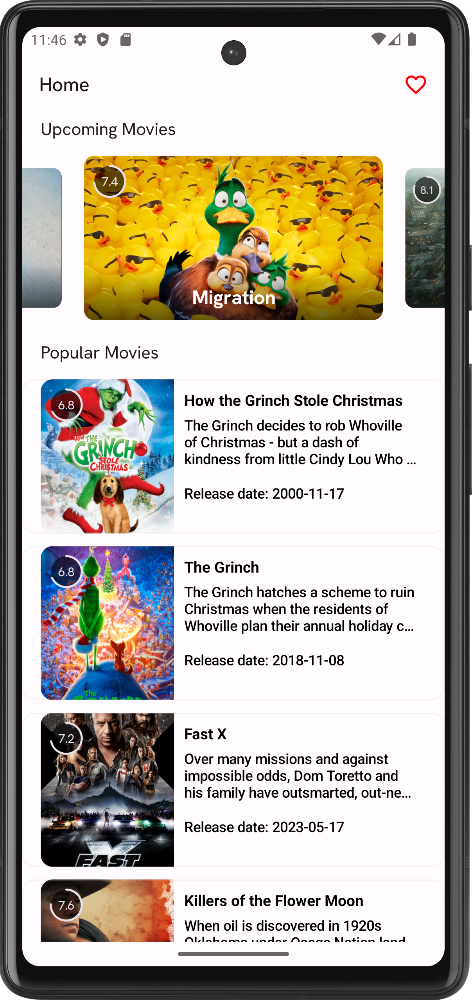
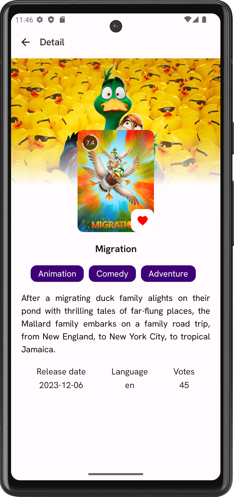
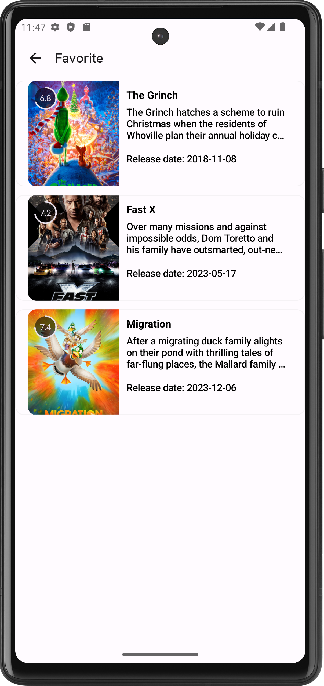

<h1 align="center">Moov</h1>
<h4 align="center">A movie listing app showcasing various user interfaces implemented with Jetpack Compose and integrating TheMovieDb API, specifically designed as a college assignment</h4>

 

## Screenshots

## Download

Go to [Releases](https://github.com/muhxdan/Moov-app/releases) page to download the latest APK.

## Technologies

- [Kotlin](https://kotlinlang.org/) - 100% Kotlin
- [Jetpack Compose](https://developer.android.com/jetpack/compose) for Declarative UI
- [Accompanist](https://github.com/google/accompanist) for Compose UI Widgets
- [Splash Screen API](https://developer.android.com/develop/ui/views/launch/splash-screen) for
  Splash Screen
- [Coil](https://github.com/coil-kt/coil) for Image Network Loading
- [Coroutines](https://github.com/Kotlin/kotlinx.coroutines) for Asynchronous Operations
- [StateFlow](https://kotlin.github.io/kotlinx.coroutines/kotlinx-coroutines-core/kotlinx.coroutines.flow/-state-flow/)
  for State Management
- [ViewModel](https://developer.android.com/topic/libraries/architecture/viewmodel) for MVVM
  Architecture
- [Dagger Hilt](https://developer.android.com/training/dependency-injection/hilt-android) for
  Dependency Injection
- [Retrofit](https://square.github.io/retrofit/) for Network Operations
- [Room](https://developer.android.com/training/data-storage/room) for Local Database
- [TheMovieDb(Tmdb) Api](https://developers.themoviedb.org/3) for Movie Data